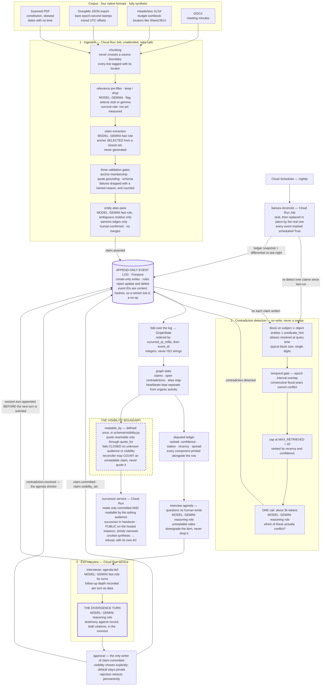

# Architecture

Baraza is a log, a fold, and three readers.

Everything a judge needs to check is visible in the shape: writes go to an
append-only event log; every graph state is a fold over that log; contradiction
detection happens **on write** against a bounded block rather than as a sweep; and
every read path — the ledger, the agenda, the interviewer, the successor — passes
through one visibility predicate before any text is rendered.

A static rendering of the same diagram, for contexts that do not run Mermaid, is at
[`architecture.svg`](architecture.svg).

---

## The system



---

## Which model does what

Model **roles**, not model IDs. The pinned identifiers live in exactly one module,
`src/baraza/schema/models.py`, and `scripts/compliance.py` fails the build on a
model-ID literal written anywhere else in the tree — including, by the same
principle, in this document. `make verify-models` resolves every pin against live
Vertex; until it has run green against the target project, no document here states
which model version shipped. A pinned literal nobody checked is a plausible value
where a verified one belongs.

| Role | Where it is called | Why that role |
|---|---|---|
| **Gemini, reasoning role** | Contradiction adjudication, agenda synthesis, the divergence turn, successor-mode synthesis | Every call that must be right more than it must be quick. A wrong adjudication puts a false contradiction in front of a departing officer and spends the scarcest resource in the system — their attention. |
| **Gemini, fast role** | Claim extraction over corpus chunks, entity alias proposals, the interviewer's ordinary turns and clarifying follow-ups | First-token latency is the binding constraint on the interview path, and extraction is a high-volume, structurally constrained task where the model selects from a closed set rather than composing. |
| **Gemma** | The ingestion relevance pre-filter, `keep` / `drop` per chunk, before any Gemini call | Most of a chat export is scheduling noise. Filtering it with a small model is the difference between an ingestion that costs dollars and one that costs tens of dollars. Runs behind a `stub` / `gemma` flag; night-one unattended ingestion runs `stub`, disclosed as a stub in its docstring, in `docs/metrics.json`, and in the console output of any run that used it. |
| **Text embeddings** | Blocking-key expansion in detection | Claims are embedded. The corpus is not. Brute-force top-k in memory — see the arithmetic below. |

---

## The five things this diagram asserts

### 1. The log is append-only and the graph is a fold

`src/baraza/fold/store.py` exposes `append` and `read_all`. There is no `update` and
no `delete`, and that is the interface rather than an oversight. In production,
`deploy/firestore.rules` rejects update and delete at the database level, so an
application bug cannot mutate history even if it tries. Fixing bad data means
appending a superseding event.

`src/baraza/fold/graph.py` is the only graph renderer. Every state you can see is a
fold over the log — no cache, nothing that can drift. The fold raises on an event type
it does not recognize rather than skipping it, because a silently incomplete graph is
the exact failure an append-only log exists to prevent.

Idempotence is inherited rather than implemented: claim IDs and event IDs are content
hashes, so a Cloud Run Job that dies halfway and is retried re-derives the same IDs
and the second write is a no-op. That property is what makes the nightly schedule safe
to run unattended.

### 2. Detection is bounded on write, and the arithmetic is the reason

Design assumption: a decade of records yields on the order of **3,000 claims**. The
measured count is `not yet measured` (`docs/metrics.json`, key
`claims_extracted_total`).

All-pairs over 3,000 claims:

```
3000 × 2999 / 2  =  4,498,500 comparisons
```

At one model call per comparison this is not a system, it is a bill; batching changes
the constant, not the 4.5 million. On write, with blocking, it is **one bounded call
per claim** — three thousand calls of about 3k tokens, each seeing at most 20
retrieved claims. `MAX_RETRIEVED = 20` is a constant in
`src/baraza/reconcile/detect.py`; the cap is by construction, not by hoping the blocks
stay small.

The temporal gate does the heaviest lifting on precision. A treasurer's FY24 signing
authority and their successor's FY25 authority are not a contradiction, and that
false-positive pair is a planted fixture that must not fire — under permuted
serialized offsets.

### 3. The visibility boundary is structural

- `visibility` is set at append time and never unset; a claim built without one is
  `private`.
- `readable_by(claim, audience)` is defined **once**, in
  `src/baraza/schema/visibility.py`. Divergence detection, the ledger, the agenda, the
  question renderer, the graph view and successor mode all route through it.
- The quote is not a readable attribute. It is stored protected and reachable only
  through `claim.quote_for(audience)`. Code that reaches for `claim.quote` raises
  `AttributeError` at the access site. `make compliance` fails the build if the
  protected field is named anywhere outside `src/baraza/schema/`.
- The predicate fails **closed** on unrecognized input rather than raising, because a
  raised exception can be swallowed by a caller trying to be robust, and the swallowed
  path is where leaks live.

The reconciler may **count** an unreadable claim toward a contradiction's existence.
It may never render that claim's text into a question for that audience. `RedactedClaim`
is the only thing that crosses: claim ID, subject, predicate hint, interval bounds —
no quote, no object literal, no anchor text. An agenda item whose sides the
interviewee cannot read is downgraded to an open-ended prompt, not dropped; dropping
it would let the boundary silently shrink the agenda and make the visibility choice
look free when it is not.

The successor service sits on the far side of the boundary on purpose. It reads only
claims that are both `committed` **and** readable by the audience asking — the
successor during a handover, and `Audience.PUBLIC` on the hosted instance a logged-out
judge visits, which is strictly narrower. The two halves are different axes:
`committed` is the retraction axis, reached because a human approved it and left
permanently on rejection; visibility is the disclosure axis, and it defaults to
private. A fresh deployment therefore shows a judge nothing at all, and that is the
boundary working rather than an empty database.

When the readable committed record cannot support an answer, the service refuses. The
refusal has its own acceptance criterion. A successor cannot tell a remembered fact
from a fluent guess, and a fluent guess about who can sign a cheque is worse than
silence — silence is recoverable, because they go and ask someone.

### 4. Time is integers

Every comparison in the system — fold ordering, interval overlap, turn ordering,
ledger recency — runs on integer epoch milliseconds, UTC
(`src/baraza/schema/temporal.py`). ISO-8601 is serialization only.

The corpus deliberately mixes three temporal representations: bare epoch **seconds**
in the chat export, dates with no time at all in the scanned PDF, and offset-bearing
ISO strings in interview turns. The normalizer reads integers below the
epoch-seconds ceiling as seconds and above it as millis, treats a bare `YYYY-MM-DD`
as `00:00:00Z` by documented convention, and **rejects** naive datetimes and
offsetless ISO strings rather than guessing at an offset.

The trap that proves it matters has to cross a date boundary:

| a | b | string order | instant order |
|---|---|---|---|
| `2026-05-01T20:00:00-05:00` | `2026-05-02T00:00:00Z` | `a < b` | `a > b` |

The fold-stability property test permutes serialized offsets across the golden log and
asserts an identical graph.

### 5. Autonomy is evidenced, not asserted

Cloud Scheduler triggers the reconcile Job nightly. The Job re-folds the log,
snapshots the ledger, re-runs detection over claims written since the previous run,
and writes the differential against last night's snapshot: contradictions **added**,
contradictions **retracted** because a new document settled them, and rankings that
moved.

A diff between two snapshots taken minutes apart proves nothing. The evidence is a
diff across two genuine nights with a document dropping in between — which cannot be
compressed retroactively, which is why the Scheduler is deployed early and stubbed
rather than deployed late and real.

Every event the Job appends is marked `scheduled=True`. A scheduled run is never
counted as organic activity in any accounting, anywhere.

---

## Where each box lives

| Box in the diagram | Module |
|---|---|
| Corpus readers, locator grammars | `src/baraza/ingest/readers.py`, `src/baraza/ingest/sources.py` |
| Chunking | `src/baraza/ingest/chunking.py` |
| Relevance pre-filter | `src/baraza/ingest/prefilter.py` |
| Claim extraction and its validation gates | `src/baraza/ingest/extract.py` |
| Entity table and alias pass | `src/baraza/ingest/entities.py` |
| The unattended pipeline that wires them | `src/baraza/ingest/pipeline.py` |
| Append-only store, both backends | `src/baraza/fold/store.py` |
| The fold and the graph state | `src/baraza/fold/graph.py` |
| Blocking, temporal gate, adjudication | `src/baraza/reconcile/detect.py` |
| Disputed ledger and its ranking | `src/baraza/reconcile/ledger.py` |
| Agenda generation | `src/baraza/reconcile/agenda.py` |
| Nightly Job, stub and real | `src/baraza/reconcile/job.py` |
| Differential across nights | `src/baraza/reconcile/differential.py` |
| Interviewer, adaptation, divergence turn | `src/baraza/interview/interviewer.py` |
| Session state that survives a kill | `src/baraza/interview/session_store.py` |
| Approval, promotion, visibility choice | `src/baraza/interview/approval.py` |
| Interview HTTP surface, not public, reads as owner | `src/baraza/interview/service.py` |
| Successor librarian and its refusal | `src/baraza/successor/librarian.py` |
| Successor HTTP surface — the public one, reads as public | `src/baraza/successor/service.py` |
| Spans that carry a claim digest, never a quote | `src/baraza/telemetry.py` |
| The CLI behind every demo target | `src/baraza/cli.py` |
| Images, Firestore rules, Cloud Run and Scheduler manifests | `deploy/` |
| The one visibility predicate | `src/baraza/schema/visibility.py` |
| Epoch normalization | `src/baraza/schema/temporal.py` |
| Model pins, and only here | `src/baraza/schema/models.py` |
| Every Gemini call, and the cassette replay path | `src/baraza/llm.py` |

---

## Deployment topology and least privilege

| Surface | Runtime | Trigger |
|---|---|---|
| Ingestion | Cloud Run Job | Manual or on corpus drop |
| `baraza-reconcile` | Cloud Run Job | Cloud Scheduler, nightly |
| Interview | Cloud Run service | HTTP, interactive |
| Successor | Cloud Run service | HTTP, interactive |
| Event log, sessions, entities | Firestore | — |
| All model calls | Vertex AI | — |

Service accounts are per stage. The extraction stage's account **cannot** write a
`claim.committed` event — not by convention, by IAM. Only the approval path promotes
a claim, and the promotion is a distinct event from the visibility choice so the
boundary decision is auditable separately from the approval.

A missing permission is a stop condition. It gets reported, not routed around, and
never fixed by widening a scope or a key.

---

## Status

This document describes the system as designed and, for the modules listed above, as
implemented. It is not a deployment report.

Observed on 2026-08-13, after a verification pass that ran each of these: every
module in the file map exists and imports under Python 3.14 with no cloud
credentials; `tests/unit` and `tests/property` are 154 passed; `make corpus`
regenerates 13 artifacts and re-reads every one through `baraza.ingest.readers`;
`make verify-manifest` finds 18 of 18 planted problems; `deploy/` carries the
Firestore rules and the Cloud Run and Scheduler manifests.

Not yet true: nothing is deployed; `fixtures/cassettes/` holds no recordings, so
the offline demo refuses to start and **no behaviour has been observed** —
`verify-manifest` reports 0 of 17 behaviour probes and `verify-anchors` has no
citations to resolve, both because there is no event log; no module imports ADK;
`make verify-models` has not run, so no model pin has been resolved against live
Vertex; and every entry in `docs/metrics.json` reads `not yet measured`.

The README's status table carries the per-command exit codes, `docs/compliance.md`
carries the framework gap in full, and `docs/BUILD-LOG.md` is the authority on what
has landed.
