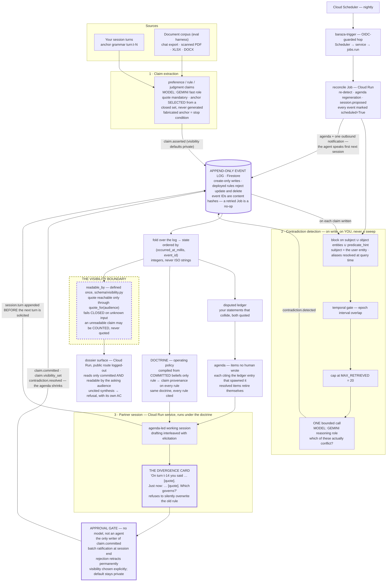

# Architecture

Baraza is a log, a fold, and a gate.

Everything a judge needs to check is visible in the shape: your turns become
claims with verbatim quotes and turn anchors; every write is an event appended
to a log that rejects edits; every rendered state — ledger, agenda, dossier,
doctrine — is a fold over that log; contradiction detection happens **on write**
against a bounded block, with you as the subject; and no belief reaches the
doctrine that governs behavior without passing an approval gate that has no
model.

A static rendering of the same diagram, for contexts that do not run Mermaid, is
at [`architecture.svg`](architecture.svg).

---

## The loop

---

## Which model does what

Model **roles**, not model IDs, in this document. The pinned identifiers live in
exactly one module, `src/baraza/schema/models.py`, resolved everywhere else via
`models.resolve(role)`; `scripts/compliance.py` fails the build on a model-ID
literal anywhere else in the source tree. The pins were live-verified against
Vertex on 2026-08-31 (the resolution `make verify-models` performs), and the
README's Google Cloud table records the verified IDs once.

| Role | Where it is called | Why that role |
|---|---|---|
| **Gemini, reasoning role** | Contradiction adjudication, agenda synthesis, the divergence turn, dossier synthesis | Every call that must be right more than it must be quick. A wrong adjudication puts a false contradiction in front of the user and spends the scarcest resource in the loop — their attention at the gate. |
| **Gemini, fast role** | Claim extraction over turns and corpus chunks, alias proposals, ordinary session turns | First-token latency binds on the session path, and extraction is high-volume and structurally constrained — the model selects anchors from a closed set rather than composing them. |

---

## What the diagram asserts

### 1. The log is append-only and every state is a fold

`src/baraza/fold/store.py` exposes `append` and `read_all`; there is no `update`
and no `delete`, and that is the interface rather than an oversight. In
production `deploy/firestore.rules` rejects update and delete at the database
level — deployed and verified live (`scripts/verify_append_only.sh`) — so an
application bug cannot mutate history even if it tries.

`src/baraza/fold/graph.py` is the only state renderer. It raises on an event
type it does not recognize rather than skipping it, because a silently
incomplete state is the exact failure an append-only log exists to prevent.
Event IDs are content hashes, so idempotence under retry is inherited, not
implemented. The fold orders events by `(occurred_at_millis, event_id)` —
integers, never strings — which is the whole reason a permutation test over
serialized UTC offsets can assert byte-identical output.

This substrate is what makes "memory with due process" more than a metaphor:
retraction is an event, adjudication is an event, and a judge checking whether a
belief predates demo day is reading timestamps in a log that provably rejects
edits.

### 2. Contradiction detection is bounded on write — and aimed at the user

Design assumption: on the order of **3,000 claims**. Measured count:
`not yet measured` (`docs/metrics.json`). All-pairs over 3,000 claims is
3000 × 2999 / 2 = **4,498,500** comparisons — a bill, not a system, and batching
changes the constant, not the 4.5 million. On write, with blocking
(`src/baraza/reconcile/detect.py`), it is one bounded call per claim: block on
subject ∪ object ∪ `predicate_hint` with aliases resolved at query time,
temporally gate on epoch interval overlap, cap at `MAX_RETRIEVED = 20`.

The retarget from records to person is a change of subject, not of machinery:
blocking on subject works identically when the subject is the user entity. What
the temporal gate removed for fiscal years (consecutive terms cannot conflict)
it removes for superseded guidance eras.

### 3. The approval gate is promotion-isolated and has no model

`claim.committed` and `claim.visibility_set` are constructed in exactly one
module, `src/baraza/interview/approval.py`. Neither the ingestion package nor
the reconcile package imports it, the deployed Firestore rules deny the event
type on create for rules-governed callers, and a unit test asserts the negative.
The approver is deliberately **not** an `LlmAgent` — promotion is the one
operation that must never be a model's judgment call — and the ADK agent fleet
has peer and parent transfer disabled so no reasoning agent can hand work to it.

Promotion and the visibility choice are distinct events, so the disclosure
decision is auditable separately from the approval. Rejection retracts
permanently: out of retrieval, out of the ledger, out of every future agenda,
out of the next doctrine.

### 4. The doctrine is compiled, cited, and conflict-refusing

The doctrine compiler folds **committed** beliefs only into the session's
operating policy, carrying a rule ← claim provenance map: every rule names the
claim ID and quote that put it there. Compilation is deterministic — replaying
the fold reproduces the doctrine byte for byte under permuted serialized offsets
— and the deterministic claim stops there: whether the model complies with a
cited rule is a measured number with provenance, never an assertion.

When two committed rules conflict, the compiler **refuses to pick between
them**. The conflict surfaces as a divergence card and an agenda item, and only
an adjudication event resolves it. The doctrine diff between epochs names, per
changed rule, the claim that changed it — an honest artifact, because the
provenance map is emitted by the compiler, not inferred from output.

### 5. The visibility boundary is structural

- `visibility` is set at append time and never unset; a claim built without one
  is `private` — beliefs about you are private by default.
- `readable_by(claim, audience)` is defined **once**, in
  `src/baraza/schema/visibility.py`; every read path routes through it.
- The quote is not a readable attribute. It lives behind
  `claim.quote_for(audience)`; code reaching for the raw field raises at the
  access site, and `make compliance` fails the build if the protected field is
  named outside `src/baraza/schema/`.
- The predicate fails **closed** on unrecognized input rather than raising,
  because a raised exception can be swallowed by a caller trying to be robust,
  and the swallowed path is where leaks live.

The reconciler may **count** an unreadable claim toward a contradiction's
existence; it may never render its text. `RedactedClaim` is the only thing that
crosses: structural coordinates, no quote, no object literal, no anchor text. An
agenda item with unreadable sides is downgraded to an open-ended prompt, never
dropped — dropping it would let the boundary silently shrink the agenda.

The public dossier surface (`src/baraza/dossier/service.py`) sits on the far
side on purpose: it reads only claims that are both `committed` **and** readable
by the asking audience — `Audience.PUBLIC` for a logged-out judge, strictly
narrower than what the owner sees. A fresh deployment shows a judge nothing at
all, and that is the boundary working, not an empty database. When the readable
committed record cannot support an answer, the librarian
(`src/baraza/dossier/librarian.py`) refuses, and the refusal has its own
acceptance criterion — withheld counts are honest, withheld contents are not
disclosed.

### 6. Time is integers

Every comparison — fold ordering, interval overlap, turn ordering, recency —
runs on integer epoch milliseconds, UTC (`src/baraza/schema/temporal.py`).
ISO-8601 is serialization only. The trap that proves it matters crosses a date
boundary:

| a | b | string order | instant order |
|---|---|---|---|
| `2026-05-01T20:00:00-05:00` | `2026-05-02T00:00:00Z` | `a < b` | `a > b` |

Naive datetimes and offsetless strings are rejected loudly at the parse site
rather than guessed at. The fold-stability property test permutes serialized
offsets across the golden log and asserts identical output.

### 7. Initiation is evidenced, not asserted

Cloud Scheduler fires nightly through `baraza-trigger` — the OIDC-guarded hop
adopted after the direct Scheduler→Jobs-API path 403'd (root cause and fix in
`docs/deploy-postmortem.md`; no scope was widened — the same service account does the
same thing, one hop later). The reconcile Job re-detects over claims written
since its last recorded adjudication, regenerates the agenda from open
contradictions and stale beliefs, appends a `session.proposed` event, and sends
one outbound notification — so the next session opens with the agent speaking
first, each agenda item citing the ledger entry that spawned it.

Every event a scheduled run appends is marked `scheduled=True`
(`src/baraza/reconcile/differential.py` carries the scheduled-vs-manual
discipline), and a scheduled run is never counted as organic activity in any
accounting. Multi-day initiation is proven by timestamps accumulating in the
append-only log, which cannot be compressed retroactively — the reason the
trigger runs live rather than being staged for the video.

---

## Where each box lives

| Box | Module |
|---|---|
| Turn/corpus claim extraction and its validation gates | `src/baraza/ingest/extract.py` |
| Corpus readers, chunking, entities (eval harness) | `src/baraza/ingest/` |
| Append-only store, both backends | `src/baraza/fold/store.py` |
| The fold | `src/baraza/fold/graph.py` |
| Blocking, temporal gate, adjudication | `src/baraza/reconcile/detect.py` |
| Disputed ledger and its ranking | `src/baraza/reconcile/ledger.py` |
| Agenda generation and retirement | `src/baraza/reconcile/agenda.py` |
| Scheduled reconcile Job, differential across runs | `src/baraza/reconcile/job.py`, `differential.py` |
| Initiation — agenda, `session.proposed`, one notification | `src/baraza/reconcile/initiate.py` |
| The Scheduler-facing trigger service (`baraza-trigger`) | `src/baraza/reconcile/trigger_service.py` |
| **Doctrine compiler — rule ← claim provenance, byte-stable** | `src/baraza/doctrine/compiler.py` |
| Doctrine diff — the causal claim per changed rule | `src/baraza/doctrine/diff.py` |
| The web face over the service seams | `src/baraza/web/` |
| Session engine and the divergence turn | `src/baraza/interview/interviewer.py` |
| Session state that survives a kill | `src/baraza/interview/session_store.py` |
| **The approval gate — sole writer of `claim.committed`** | `src/baraza/interview/approval.py` |
| Session HTTP surface, private, reads as owner | `src/baraza/interview/service.py` |
| Dossier librarian and its refusal | `src/baraza/dossier/librarian.py` |
| Dossier HTTP surface — the public one | `src/baraza/dossier/service.py` |
| The one visibility predicate | `src/baraza/schema/visibility.py` |
| Epoch normalization | `src/baraza/schema/temporal.py` |
| Model pins, and only here | `src/baraza/schema/models.py` |
| Every Gemini call, and the cassette replay path | `src/baraza/llm.py` |
| ADK agent fleet, transfer-disabled | `src/baraza/agents.py` |
| The CLI behind every demo target | `src/baraza/cli.py` |
| Images, Firestore rules, Run and Scheduler manifests | `deploy/` |

[`BUILD-LOG.md`](BUILD-LOG.md) is the authority on what has landed since this
map was written.

---

## Deployment topology and least privilege

| Surface | Runtime | Trigger |
|---|---|---|
| Ingestion | Cloud Run Job | Manual or on corpus drop |
| Reconcile | Cloud Run Job | Cloud Scheduler → `baraza-trigger` (OIDC) |
| Session service | Cloud Run service | HTTP, private |
| Dossier surface | Cloud Run service | HTTP, public, reads as `PUBLIC` |
| Event log, sessions, entities | Firestore | — |
| All model calls | Vertex AI, location `global` | — |

Service accounts are per stage, and it is worth being exact about what holds the
promotion boundary, because an earlier revision said "by IAM" and that was
wrong: Firestore IAM is per-operation and carries no predicate over document
contents. What holds it is the **code path** (`claim.committed` is constructed
only in `interview/approval.py`, which the ingest and reconcile packages do not
import), the **deployed rules** (which deny the event type on create for
rules-governed callers), and a **unit test asserting the negative**. What IAM
does enforce is the guarantee that matters most: append-only — create without
update or delete — for every writer, plus the read-only public surface.
`deploy/README.md` carries the per-row matrix.

A missing permission is a stop condition. It gets reported, not routed around,
and never fixed by widening a scope or a key — a discipline the Scheduler 403
vindicated: the widening experiment bought nothing, and the fix was
architectural.

---

## Status

This document describes the system as designed and, for every module in the map
above, as implemented in the tree at the time of writing (2026-08-31; all unit,
property and integration tests green — run `make test` for the count, which is
not transcribed here because a transcribed count is stale on the next commit).
It is not a deployment report: the README's status table carries observed
per-command exit codes, `docs/deploy-postmortem.md` carries the dated deploy evidence,
and `docs/BUILD-LOG.md` is the authority on what has landed.
